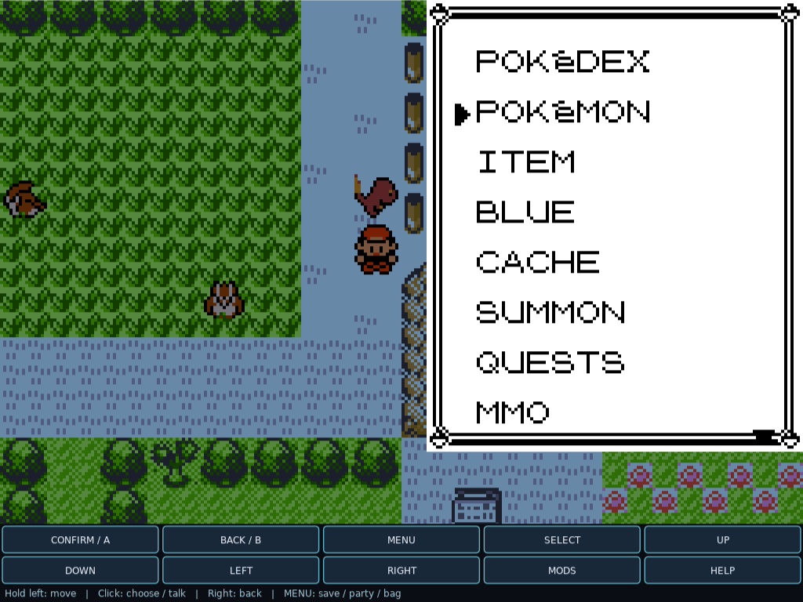
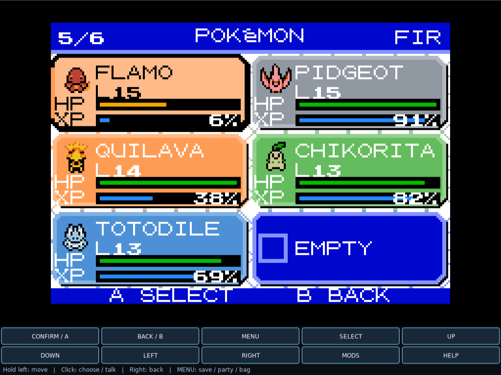

# Mouse Adventure 1.2.0

Mouse-first, single-player Pokemon for Gen1Recomp Red, Blue and Yellow.
This builds on the working eight-direction steering without changing the
original turn-based battles, progression, collision, or save rules.

Maintained by [javi5cript](https://github.com/javi5cript).
Mod code is licensed under [MIT](LICENSE), with upstream acknowledgments and notices in
[THIRD_PARTY_NOTICES.md](THIRD_PARTY_NOTICES.md).

## In-game screenshots

Captured in Blue / Ultimate Kanto with additional mods enabled. The overworld
Pokemon and modern party artwork come from that setup, not Mouse Adventure.

### Hold and steer

**Hold left-click and drag to steer.** The live white line and arrow run from
the player toward the pointer, showing the current steering direction.
This is the mod's actual in-game guide, not an arrow added to the screenshot.
Release to stop issuing movement; the current tile step finishes normally.

### Mouse-only menus

Open the native menu with **MENU**, click supported choices, and use
**BACK / B** or right-click to return. The dock stays below the play area.
The extra menu entries shown here belong to the installed custom-cart mods.

### Modern party screen

The controller dock remains available on the party screen, with direct card
selection supported by the Modern Party UI adapter.

Screenshots document compatibility and gameplay. Depicted game and
third-party artwork belongs to its respective owners and is not covered by
this repository's MIT license.

## Status and installation

This repository contains the 1.2.0 source snapshot. A packaged public release
has not been published yet. Broader compatibility testing is still needed;
do not assume every replacement UI is directly clickable.

Requires [Gen1Recomp](https://github.com/bryanthaboi/gen1recomp) and your own
legally obtained game data. This is not a standalone game.

1. Close the game and back up any existing `mods\click_to_move` folder.
2. Create `click_to_move` inside the engine's user-data `mods` directory.
   On Windows this is `%APPDATA%\pokemon-love2d\mods\click_to_move`.
3. Copy `manifest.json`, `main.lua`, `mouse_ui.lua`, `mouse_targets.lua`,
   `README.md`, `LICENSE`, and `THIRD_PARTY_NOTICES.md` into that folder.
4. Start Red, Blue, or Yellow and enable **Mouse Adventure** in the mod manager.
   Keep overworld VOXEL and TILT off for held steering.

To uninstall, close the game and remove only `mods\click_to_move`, or disable
Mouse Adventure in the mod manager. Leave saves, carts, and other mods alone.
Existing installations retain the `click_to_move` ID and option keys.

GitHub's automatic source ZIP contains a repository wrapper folder. For an
installable mod archive, package the seven files above directly at the ZIP
root and name it `click_to_move-1.2.0.zip`; do not include `.git`, ROMs, saves,
engine files, or other mods. The source ZIP is not a prepared mod release.

## Mouse controls

- Hold the left mouse button to move toward the cursor, relative to the player.
- Drag while holding to steer up, down, left, right or along the four diagonals.
- Release to stop issuing movement. The current tile step finishes normally.
- Move the cursor onto the player to pause in the dead zone without releasing.
- Click dialogue to send one normal A press. Scripted waits and sounds still apply.
- Click a supported menu row or battle choice to select and confirm it.
- Hover a supported choice to see a cyan outline of its clickable area.
- Right-click to send B in menus, including backing out of move selection.
- Right-click during steering cancels movement instead of also interacting.
- Keyboard/controller input takes priority over pending mouse actions.
- A touch held outside the engine's virtual controls works the same way.

There is no destination tile or route queue: keep holding to keep moving.
To speak to an NPC, read a sign, open a door requiring interaction, or use a
field action, face it with steering or a dock arrow and click INTERACT / A.
Arbitrary NPC clicks do not teleport, turn the player mid-step, or pathfind.

## Action dock: mouse-only fallback

A separate strip below the game contains every Game Boy button. It reserves
window space rather than covering dialogue, menus, or the battle HUD.

| Control | Purpose |
| --- | --- |
| INTERACT / A or CONFIRM / A | Talk, confirm, advance text, select the current item |
| BACK / B | Cancel, close a menu, return to the previous screen |
| MENU | Open the native Start menu: Party, Bag, Pokedex, Save, Options |
| SELECT | Native secondary action, including swapping moves where supported |
| UP / DOWN / LEFT / RIGHT | Hold to navigate or walk/face using native D-pad input |
| MODS | Open or close the engine's mod manager (the normal F10 action) |
| HELP | Show a short control reference in the dock |

On the native naming grid the controls read TYPE, DELETE, DONE and CASE.
Click letters directly, or use the arrows and TYPE. Preset names remain native
menu choices. No operating-system text entry is injected.

When a replacement menu has no reliable direct-click adapter, use the dock's
arrows and CONFIRM instead. This still avoids keyboard use without pretending
that every custom menu has a supported visual hitbox.

### Overworld Pokemon

When Wilds of Kanto's overworld catching is enabled, two more controls appear:

- HOLD: THROW holds the configured Wilds modifier/action combo; release inside
  the dock to let Wilds finish its normal throw.
- NEXT BALL calls Wilds' own selected-ball cycling action.

Stop walking before charging. Right-click, focus loss, leaving the dock, or a
state change cancels the charge rather than accidentally throwing. The mod
respects whether Wilds uses B+A or Select+A; a disabled combo is explained in
the dock. Wild spawn rates, encounters, inventory and catch calculations are
not changed.

## Quality-of-life analysis and design boundaries

The engine and the installed modern UI mods do not share a universal mouse
selection API. A replacement battle panel, a classic bag, and a native dialogue
box have different layouts and input rules. Reliable mouse support therefore
needs two layers: precise adapters for recognized layouts and a complete visible
controller fallback for everything else.

| Screen | Direct-click coverage |
| --- | --- |
| Native menus and confirmations | Visible rows, YES/NO, scrolled lists |
| Dialogue | Ready text pages; scripted delays remain native |
| Native battles | Command and move choices, Safari and Mimic, classic and wide layouts |
| Party | Native rows and recognized Modern Party cards/submenus |
| PC | Recognized Modern PC slots, actions and box picker |
| Pokedex | Native rows and recognized Modern Pokedex rows/actions/filters |
| Naming | Native letter grid and recognized modern naming controls |
| Bag | Native list rows and recognized Modern Bag rows |
| Other replacement screens | Existing mouse handlers first, then explicit dock controls |

Gen1BattleUI replacement grids are adapted only without Kanto Gear loaded.
With Kanto Gear, its existing companion controls retain ownership; the dock
remains available rather than placing guessed targets over a hidden battle UI.
Operating-system file dialogs and arbitrary mod text/search fields are not
guaranteed to be keyboard-free.

UI clicks use the renderer's actual UI scale and positioned anchors, not the
overworld camera transform. That matters for zoom, wide battles, high-DPI
windows and edge-anchored dialogue. Existing higher-priority mod pointer
handlers retain first refusal inside the game. The dock's viewport reservation
is applied before Kanto Gear calculates its companion-panel layout.

Each click belongs to one state, mode and battle phase. Selection is queued for
a logic tick, changes only the UI cursor, and sends a normal A press. It does not
call a battle decision, purchase, release, save or item-use callback directly.
A stale click cannot confirm a newly opened screen. NPC actions wait for the
current tile step to finish. Unknown menus are not treated as a blind A-click.

Saving remains MENU -> SAVE -> the game's confirmation. Likewise, a
noncancelable choice remains noncancelable; right-click is B, not a forced
stack pop. Scripted battles and the old-man catching demonstration retain
their native control. These are intentional safeguards, not missing shortcuts.

This is a Diablo-like control scheme, not real-time combat or freeform 3D
movement. Multiplayer development is out of scope. Existing MMO installations
are not removed or configured, and this mod never connects to a server.

## Map sections and obstacles

The mod sends normal, source-owned D-pad input; it never writes player position,
facing, collision data, save data or network state. Holding through a connected
map edge continues into the next section. Door fades temporarily release input
and resume steering after arrival if the same pointer is still held.

The engine remains responsible for collisions, ledges, surfing, encounters
and scripts. It cannot walk through blocked exits.
Diagonal steering alternates horizontal and vertical tile steps, not freeform
diagonal physics or diagonal sprites. If one axis is blocked, the other is
retried after 12 logic ticks. Speed remains the engine's normal step speed.

Menus and battles cancel the gesture and require a new press afterward.
Scripts and input locks pause steering. Mouse release still cancels during a
fade or script. Focus loss/input recovery cancels through the engine's pointer
API. Moving outside the game window releases movement until the pointer comes
back; losing focus cancels it entirely.

## Options

Open this mod's settings in the mod manager.

| Option | Default | Purpose |
| --- | --- | --- |
| HOLD TO MOVE | ON | Enables held steering |
| STEERING GUIDE | ON | Draws a line and arrow toward the cursor |
| DEAD ZONE | 6 | Pause radius around the player, in world pixels (2-16) |
| MOUSE MENUS AND DIALOGUE | ON | Enables UI clicks, contextual B and the dock |
| MOUSE ACTION BAR | ON | Reserves space for visible controller and Wilds controls |

## Compatibility

Requires Gen1Recomp 0.2.56 or later in the pre-2.0 series.
Use the flat overworld with VOXEL and TILT off. Perspective rendering is not
supported: the mod rejects steering and logs a warning instead of moving in
the wrong direction. Standard zoom and high-DPI rendering use the engine's
actual world-blit coordinates rather than the UI rectangle.

The folder/id remains `click_to_move`, preserving existing enablement and
steering settings. Install all three Lua files (`main.lua`, `mouse_ui.lua`,
`mouse_targets.lua`) with the manifest, then restart the game. New options
default to ON. This does not modify the engine executable or other mods.

## Credits and scope

Built for Gen1Recomp by bryanthaboi and contributors. Compatibility work
references the modern UI projects maintained by piftee, Gen1WildUI and
Gen1BattleUI by wild1walker, Wilds of Kanto by YoDrehDenSwagAuf, and Kanto Gear
by AverageConsumer. These are separate projects with their own licenses;
they are not bundled or required for the basic mouse controls.

This repository contains mod code and documentation only, not ROM data,
extracted game assets, engine source, or third-party mod distributions.
Pokemon and related names belong to their respective owners. This is an
unofficial fan project, not affiliated with Nintendo, Creatures, or Game Freak.
The MIT license grants no rights to their games, artwork, or trademarks.
