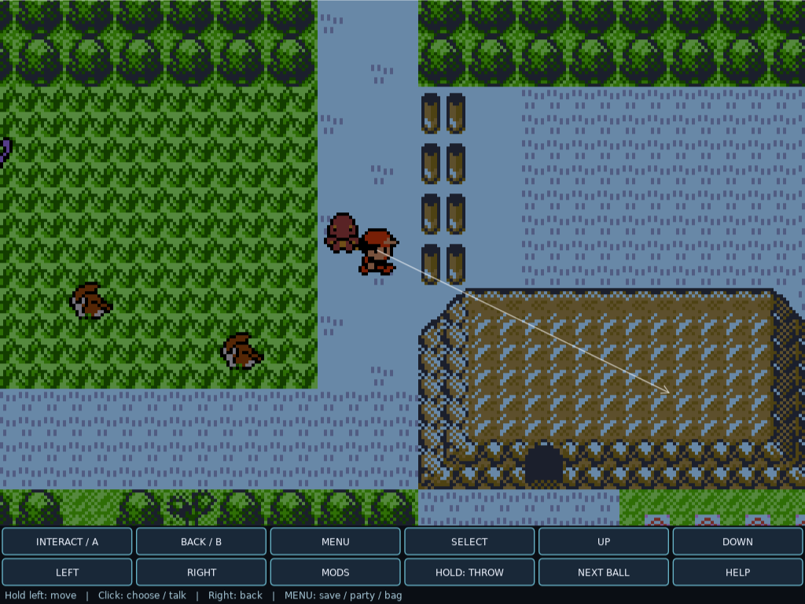

# Mouse Adventure 1.3.0

**Hold to move. Point to steer. Click to interact.**

Mouse-first, single-player Pokemon for Gen1Recomp Red, Blue and Yellow.
This builds on the working eight-direction steering without changing the
original turn-based battles, progression, collision, or save rules.

Maintained by [javi5cript](https://github.com/javi5cript).
Mod code is licensed under [MIT](LICENSE), with upstream acknowledgments and notices in
[THIRD_PARTY_NOTICES.md](THIRD_PARTY_NOTICES.md).

## Mouse Adventure at a glance

**Point-to-steer, not click-to-destination.** Hold the left mouse button and
point in a direction relative to your character. Move the cursor while holding
to steer up, down, left, right, or into one of four diagonal sectors. You keep
moving beyond the original cursor location as long as it remains ahead of you.
A live line and arrow show your steering direction. Release to stop issuing
movement; the current tile step finishes normally.



*Mouse Adventure's live direction guide and action dock. Captured in a modded
game; additional world content is not included with Mouse Adventure.*

Click to advance dialogue or confirm supported menu and battle choices.
Click an adjacent NPC, item ball, sign, or solid object to face and interact
with it. Clerks and nurses can also be clicked across a single counter.
Right-click to go back. The action dock provides clickable Game Boy controls
below the play area, so you can interact, open menus, and navigate without
reaching for the keyboard.

**Works with tilt and the voxel orbit.** Held steering and click-to-interact
now run in the flat 2D overworld, the engine's TILT view, and the voxel mod's
orbit/diorama levels (1-5). These cameras only pitch down from the south with
no yaw, so world east/west stays screen left/right and north/south stays
up/down; steering points relative to the centre of the view. The free-look
voxel cameras (first-person level 6 and third-person level 7) have no fixed
mapping and are not supported -- the mod steps aside and logs a warning there
rather than moving you the wrong way.

## Status and installation

Mouse Adventure **v1.3.0 (public beta)** is published. Download
`click_to_move-1.3.0.zip` from the
[releases page](https://github.com/javi5cript/gen1recomp-mouse-adventure/releases).
Broader clean-game compatibility testing is ongoing; do not assume every
replacement UI is directly clickable, and please report any screen that does not
take clicks.

Requires [Gen1Recomp](https://github.com/bryanthaboi/gen1recomp) and your own
legally obtained game data. This is not a standalone game.

**Install (recommended):** in the launcher, open **MODS -> Import mod .zip**,
select `click_to_move-1.3.0.zip`, enable **Mouse Adventure**, and start Red,
Blue, or Yellow. Held steering runs in the flat, TILT, and voxel-orbit
overworlds; only the free-look voxel cameras (levels 6 and 7) are unsupported.

**Manual install (alternative):**

1. Close the game and back up any existing `mods\click_to_move` folder.
2. Create `click_to_move` inside the engine's user-data `mods` directory.
   On Windows this is `%APPDATA%\pokemon-love2d\mods\click_to_move`.
3. Copy `manifest.json`, `main.lua`, `mouse_ui.lua`, `mouse_targets.lua`,
   `README.md`, `LICENSE`, and `THIRD_PARTY_NOTICES.md` into that folder.
4. Start Red, Blue, or Yellow and enable **Mouse Adventure** in the mod manager.
   Held steering runs in the flat, TILT, and voxel-orbit overworlds.

To uninstall, close the game and remove only `mods\click_to_move`, or disable
Mouse Adventure in the mod manager. Leave saves, carts, and other mods alone.
Existing installations retain the `click_to_move` ID and option keys.

The release asset `click_to_move-1.3.0.zip` is already packaged this way, with
the seven files at the archive root. GitHub's automatic *source* ZIP is
different: it wraps everything in a repository folder and is not an installable
mod release. If you build your own archive, package the seven files directly at
the ZIP root and do not include `.git`, ROMs, saves, engine files, or other mods.

## Development workflow

Edit and commit this repository, never the installed mod copy. This is a Lua
mod: "build" means validate and package, not recompile or patch `gen1recomp.exe`.
The engine loads the installed Lua files when the game starts.

See [Development setup](docs/DEVELOPMENT.md) for prerequisites, local paths,
commit/install order, backups, and testing boundaries.

```powershell
npm ci
# Once: copy .dev.example.json to .dev.local.json and set GameDirectory.
.\scripts\dev.ps1 -Task Test
# Review and commit the changes before deploying them.
.\scripts\dev.ps1 -Task Install
# Or install and open Yellow; save and close any running game first.
.\scripts\dev.ps1 -Task Run -Game yellow
```

Build, Install and Run all run the regression suite first. Install deploys the
built ZIP only to `mods\click_to_move`, backs up the previous copy, and refuses
to proceed while Gen1Recomp is running. Saves, game options, other mods and
the engine executable are not changed. Nothing is automatically pushed,
tagged or published by the development script.

### Why Mouse Adventure?

**Mouse Adventure** remains the name because this is a mouse-first control
experience, not only a movement mod: steering, nearby interactions, dialogue,
menus, battles and the controller dock all belong together. The descriptive
tagline is **"Hold to move. Point to steer. Click to interact."** The repository
name and `click_to_move` mod ID remain unchanged for compatibility; that ID
does not imply destination-based pathfinding.

## Mouse controls

- Click the intro or title screen to send A; mandatory startup animations
  keep their normal timing. Click a main-menu row, then the Continue info
  box to load an existing save.
- Hold the left mouse button to move toward the cursor, relative to the player.
- Drag while holding to steer up, down, left, right or along the four diagonals.
- Release to stop issuing movement. The current tile step finishes normally.
- Move the cursor onto the player to pause in the dead zone without releasing.
- Click a nearby NPC, item ball, sign, or solid scenery to face it and
  interact once. Stand on a completed tile, directly beside the target
  (not diagonally); a single counter can separate you from an NPC.
- Click anywhere in the game view to advance a waiting dialogue prompt,
  including battle messages and Oak's Yellow catching demonstration.
  Scripted waits, animations, sounds, and automatic demonstration choices still apply.
- Click a supported menu row or battle choice to select and confirm it.
- Hover a supported choice to see a cyan outline of its clickable area.
- Right-click to send B in menus, including backing out of move selection.
- Right-click during steering cancels movement instead of also interacting.
- Press G in the overworld to hide or show the steering line and arrow. The
  saved STEERING GUIDE option sets the startup state; the hotkey flips it on
  the fly and never fires while naming or in a menu.
- Keyboard/controller input takes priority over pending mouse actions.
- A touch held outside the engine's virtual controls works the same way.

There is no destination tile or route queue: keep holding to keep moving.
Nearby object clicks use native D-pad turning followed by A, preserving
dialogue, item capacity checks, scripts and save rules. Empty ground, water,
and distant targets keep held steering; there is no automatic approach or
repeated interaction while held. Clicking solid scenery attempts the normal
interaction even when the tile has nothing to say. For other interactions
and field actions, face the target and use INTERACT / A or the party menu.

## Action dock: mouse-only fallback

A separate strip below the game contains every Game Boy button. It reserves
window space rather than covering dialogue, menus, or the battle HUD.

| Control | Purpose |
| --- | --- |
| INTERACT / A or CONFIRM / A | Talk, confirm, advance text, select the current item |
| BACK / B | Cancel, close a menu, return to the previous screen |
| MENU | Open the native Start menu: Party, Bag, Pokedex, Save, Options |
| SELECT | Native secondary action, including swapping moves where supported |
| UP / DOWN / LEFT / RIGHT | Hold to navigate or walk/face using native D-pad input |
| MODS | Open or close the engine's mod manager (the normal F10 action) |
| HELP | Show a short control reference in the dock |

On the native naming grid the controls read TYPE, DELETE, DONE and CASE.
Click letters directly, or use the arrows and TYPE. Preset names remain native
menu choices. No operating-system text entry is injected.

When a replacement menu has no reliable direct-click adapter, use the dock's
arrows and CONFIRM instead. This still avoids keyboard use without pretending
that every custom menu has a supported visual hitbox.

### Overworld Pokemon

When Wilds of Kanto's overworld catching is enabled, two more controls appear:

- HOLD: THROW holds the configured Wilds modifier/action combo; release inside
  the dock to let Wilds finish its normal throw.
- NEXT BALL calls Wilds' own selected-ball cycling action.

Stop walking before charging. Right-click, focus loss, leaving the dock, or a
state change cancels the charge rather than accidentally throwing. The mod
respects whether Wilds uses B+A or Select+A; a disabled combo is explained in
the dock. Wild spawn rates, encounters, inventory and catch calculations are
not changed.

## Quality-of-life analysis and design boundaries

The engine and the installed modern UI mods do not share a universal mouse
selection API. A replacement battle panel, a classic bag, and a native dialogue
box have different layouts and input rules. Reliable mouse support therefore
needs two layers: precise adapters for recognized layouts and a complete visible
controller fallback for everything else.

| Screen | Direct-click coverage |
| --- | --- |
| Overworld | Adjacent NPCs, item balls, signs and solid scenery; NPCs across one counter |
| Startup | Intro/title native A input, main-menu rows and Continue info box |
| Native menus and confirmations | Visible rows, YES/NO, scrolled lists |
| Dialogue | Ready text pages; scripted delays remain native |
| Native battles | Command and move choices, Safari and Mimic, classic and wide layouts |
| Party | Native rows and recognized Modern Party cards/submenus |
| PC | Recognized Modern PC slots, actions and box picker |
| Pokedex | Native rows and recognized Modern Pokedex rows/actions/filters |
| Naming | Native letter grid and recognized modern naming controls |
| Bag | Native list rows and recognized Modern Bag rows |
| Other replacement screens | Existing mouse handlers first, then explicit dock controls |

Gen1BattleUI replacement grids are adapted only without Kanto Gear loaded.
With Kanto Gear, its existing companion controls retain ownership; the dock
remains available rather than placing guessed targets over a hidden battle UI.
Operating-system file dialogs and arbitrary mod text/search fields are not
guaranteed to be keyboard-free.

UI clicks use the renderer's actual UI scale and positioned anchors, not the
overworld camera transform. That matters for zoom, wide battles, high-DPI
windows and edge-anchored dialogue. Existing higher-priority mod pointer
handlers retain first refusal inside the game. The dock's viewport reservation
is applied before Kanto Gear calculates its companion-panel layout.

Each click belongs to one state, mode and battle phase. Selection is queued for
a logic tick, changes only the UI cursor, and sends a normal A press. It does not
call a battle decision, purchase, release, save or item-use callback directly.
A stale click cannot confirm a newly opened screen. Direct NPC clicks start
only while standing still; the dock's A action can wait for a tile step to
finish. Unknown menus are not treated as a blind A-click.

Saving remains MENU -> SAVE -> the game's confirmation. Likewise, a
noncancelable choice remains noncancelable; right-click is B, not a forced
stack pop. Scripted battles and the old-man catching demonstration retain
their native control. These are intentional safeguards, not missing shortcuts.

This is a Diablo-like control scheme, not real-time combat or freeform 3D
movement. Multiplayer development is out of scope. Existing MMO installations
are not removed or configured, and this mod never connects to a server.

## Map sections and obstacles

The mod sends normal, source-owned D-pad input; it never writes player position,
facing, collision data, save data or network state. Holding through a connected
map edge continues into the next section. Door fades temporarily release input
and resume steering after arrival if the same pointer is still held.

The engine remains responsible for collisions, ledges, surfing, encounters
and scripts. It cannot walk through blocked exits.
Diagonal steering alternates horizontal and vertical tile steps, not freeform
diagonal physics or diagonal sprites. If one axis is blocked, the other is
retried after 12 logic ticks. Speed remains the engine's normal step speed.

Menus and battles cancel the gesture and require a new press afterward.
Scripts and input locks pause steering. Mouse release still cancels during a
fade or script. Focus loss/input recovery cancels through the engine's pointer
API. Moving outside the game window releases movement until the pointer comes
back; losing focus cancels it entirely.

## Options

Open this mod's settings in the mod manager.

| Option | Default | Purpose |
| --- | --- | --- |
| HOLD TO MOVE | ON | Enables held steering |
| STEERING GUIDE | ON | Draws a line and arrow toward the cursor |
| DEAD ZONE | 6 | Pause radius around the player, in world pixels (2-16) |
| MOUSE MENUS AND DIALOGUE | ON | Enables UI clicks, contextual B and the dock |
| MOUSE ACTION BAR | ON | Reserves space for visible controller and Wilds controls |
| GUIDE HOTKEY (G) | ON | Lets the G key hide or show the steering guide in the overworld |

## Compatibility

Requires Gen1Recomp 0.2.56 or later in the pre-2.0 series.

Held steering and click-to-interact work in three overworld cameras:

- the flat 2D blit (default),
- the engine's **TILT** view, and
- the **voxel** mod's orbit/diorama levels 1-5.

All three pitch down from the south without yaw, so the mod steers relative to
the centre of the view. Standard zoom and high-DPI rendering use the engine's
actual world-blit coordinates rather than the UI rectangle.

Known limitations:

- **Free-look voxel cameras are unsupported.** Voxel first-person (level 6) and
  third-person free-cam (level 7) rotate the yaw freely, so screen directions no
  longer map to fixed world directions. In these modes the mod stops steering
  and logs a warning instead of moving you the wrong way; use the voxel mod's
  own look/move controls there.
- **Tilt and voxel-orbit interaction is directional.** Clicking an adjacent NPC,
  sign, or object resolves the click to one of the four cardinal neighbours and
  faces that way. Pixel-accurate targeting of a specific on-screen sprite is
  only used in the flat overworld.
- **Steering anchors on the view centre** under tilt and voxel-orbit, which
  assumes the player is roughly centred. Accuracy can degrade at map edges where
  the camera stops following.
- **Replacement UIs are not guaranteed clickable.** Third-party battle and menu
  UIs that redraw their own screens may not expose click targets.

The folder/id remains `click_to_move`, preserving existing enablement and
steering settings. Install all three Lua files (`main.lua`, `mouse_ui.lua`,
`mouse_targets.lua`) with the manifest, then restart the game. New options
default to ON. This does not modify the engine executable or other mods.

## Credits and scope

Built for Gen1Recomp by bryanthaboi and contributors. Compatibility work
references the modern UI projects maintained by piftee, Gen1WildUI and
Gen1BattleUI by wild1walker, Wilds of Kanto by YoDrehDenSwagAuf, and Kanto Gear
by AverageConsumer. These are separate projects with their own licenses;
they are not bundled or required for the basic mouse controls.

This repository contains mod code and documentation only, not ROM data,
extracted game assets, engine source, or third-party mod distributions.
Pokemon and related names belong to their respective owners. This is an
unofficial fan project, not affiliated with Nintendo, Creatures, or Game Freak.
The MIT license grants no rights to their games, artwork, or trademarks.
